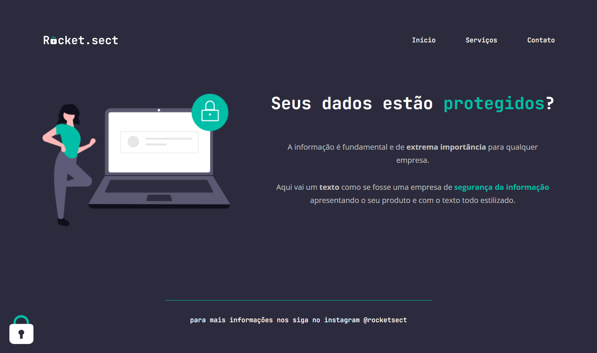

# Desafio avançado - Recriando layout

# Sobre o desafio

Nesse desafio, você deverá recriar uma aplicação, a partir de um layout, para treinar o que aprendeu até agora no **Stage 02**.

## Figma da aplicação

O figma da aplicação está disponível no [**link**](https://www.figma.com/file/EdKjPWjC8ZlbnH4XzTObv2/Explorer/duplicate)
